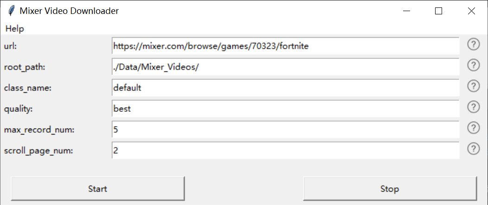

# Guiparse

给我一个使用了argparse的python脚本，丢给你一个不错的GUI！只需改很少几行贴示例代码段就好！Give me a python script with argparse, give you back a nice GUI with original function running properly!

所有的布局、label、按键都会自动根据原argparse的传入参数进行设计和布局。按下Start按键后会把填写好的表单存入"./gui/temp/args.pkl"文件中，并自动开始您原来的`main.py`文件，在main中读取变量值。一切都是自动的。
